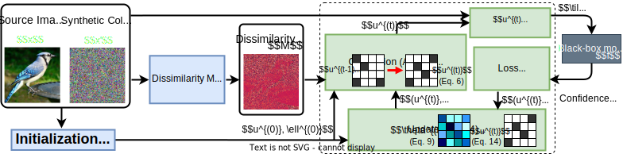
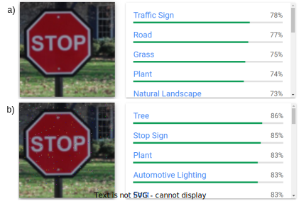
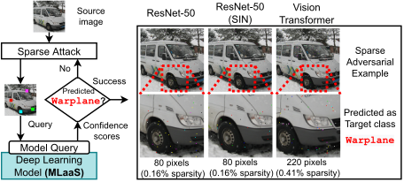

## Welcome to GitHub Pages of BruSLeAttack

Reproduce our results: [GitHub](https://github.com/BruSLiAttack/BruSLiAttack.github.io)

Check out our paper: [BruSLeAttack: A Query-Efficient Score-Based Black-Box Sparse Adversarial Attack](https://openreview.net/forum?id=PAfnMGXief)

Poster: [Poster](https://github.com/BruSLiAttack/BruSLiAttack.github.io/blob/main/asset/ICLR%202024%20-%20poster%20-%20BruSLeAttack.pdf)

Cite our research: 
```
@inproceedings{Vo2024,
    title = {BruSLeAttack: A Query-Efficient Score-Based Black-Box Sparse Adversarial Attack},
    year = {2024},
    booktitle = {International Conference on Learning Representations (ICLR)},
    author = Viet Quoc Vo and Ehsan Abbasnejad and Damith C. Ranasinghe},
}
```

#### ABSTRACT

We study the unique and less-well understood problem of generating sparse adversarial attacks simply based on observing the score-based replies to model queries. Sparse attacks aim to discover a minimum number—the l0 bounded—perturbations to model inputs to craft adversarial examples and misguide model decisions. But, in contrast to query-based dense attack counterparts against black-box models, 6 constructing sparse adversarial perturbations, even when models serve confidence score information to queries in a score-based setting, is non-trivial. Because such an attack leads to: i) an NP-hard problem; and ii) a non-differentiable search space. We develop the BruSLeAttack—a new algorithm for the problem and evaluate against Convolutional Neural Networks, Vision Transformers, recent Stylized ImageNet models, defense methods and Machine Learning as a Service (MLaaS) offerings exemplified by Google Cloud Vision. The proposed attack scales to achieve state-of-the-art attack success rates and query efficiency on standard computer visions tasks such as ImageNet across various models. Importantly, our highly query-efficient algorithm facilitates faster evaluation of model vulnerabilities and raises questions regarding the safety, security and reliability of deployed systems.

#### ALGORITHM



Figure 1: BruSLeAttack algorithm (detailed in Algo. 1). We aim to determine a set of pixels to replace in the source image x by corresponding pixels in a synthetic color image x′. In the solution, binary matrix u(t), white and black colors denote replaced and non-replaced pixels of the source image, respectively. First, our intuition is to retain useful elements in the solution u(t) by learning from historical pixel manipulations. We explore and learn the influence of selected elements by capturing it with θ using a general Bayesian framework—darker colors illustrate the higher influence of selected elements (Algo. 4). Second, we generate new pixel perturbations based on θ with the intuition that a larger pixel dissimilarity M between our search space x′ and a source image can possibly move the adversarial to the decision boundary faster and accelerate the search (Algo. 3).

#### Demonstration on Google Cloud Vision


Figure 2a: A source image is classified as _Traffic_ Sign by __Google Cloud Vision (GCV)__. With less than _500 queries_, __BruSLeAttack__ is able to yield a sparsity adversarial example (250 of 50,176 pixels are manipulated) misclassified as _Tree_ by GCV.


Figure 2b: Demonstration of sparse attacks against GCV in targeted settings with a budget of 5K queries and sparsity of $0.5% ≈ 250/(224×224)$. BruSLeAttack is able to yield adversarial examples for all clean images with less queries than Sparse-RS while Sparse-RS fails to yield adversarial examples for Mushroom, Camera,
Watch, & Building images.

#### Illustration of Sparse Adversarial Examples On _ImageNet_



Figure  3: Targeted Attack. Malicious instances is generated by BruSLeAttack with different perturbation budgets against different Deep Learning models on ImageNet. An image with ground-truth label Minibus is misclassified as a Warplane. Interestingly, BruSLeAttack requires 80 perturbed pixels (over 50,176 pixels) to fool ResNet-based models whereas it has to manipulate 220 pixels to mislead Vision Transformer.

__More visualisations:__ [Link](https://nbviewer.org/github/BruSLiAttack/BruSLiAttack.github.io/blob/main/Visualisation.ipynb)


Figure  4: Visualization of Dissimilarity Maps for Images on _ImageNet_ dataset.

__Attack demonstration__ [Link](https://nbviewer.org/github/BruSLiAttack/BruSLiAttack.github.io/blob/main/Sample%20code%20for%20demonstration%20of%20BruSLeAttack.ipynb)
