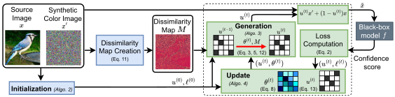

## Welcome to GitHub Pages of BruSLeAttack

Reproduce our results: [GitHub](https://github.com/BruSLiAttack/BruSLiAttack.github.io)

Check out our paper: [A Query-Efficient Score-Based Sparse Adversarial Attack](https://...)

Poster: [Poster](...)

Cite our research: 
```
@inproceedings{Anonymous...,
    title = {A Query-Efficient Score-Based Sparse Adversarial Attack},
    year = {...},
    booktitle = {...},
    author = Anonymous},
}
```

#### ABSTRACT

We study the unique and less-well understood problem of generating sparse adversarial attacks simply based on observing the score-based replies to model queries. Sparse attacks aim to discover a minimum number—the l0 bounded—perturbations to model inputs to craft adversarial examples and misguide model decisions. But, in contrast to query-based dense attack counterparts against black-box models, 6 constructing sparse adversarial perturbations, even when models serve confidence score information to queries in a score-based setting, is non-trivial. Because such an attack leads to: i) an NP-hard problem; and ii) a non-differentiable search space. We develop the BRUSLEATTACK—a new algorithm for the problem and evaluate against Convolutional Neural Networks, Vision Transformers, recent Stylized ImageNet models, defense methods and Machine Learning as a Service (MLaaS) offerings exemplified by Google Cloud Vision. The proposed attack scales to achieve state-of-the-art attack success rates and query efficiency on standard computer visions tasks such as ImageNet across various models. Importantly, our highly query-efficient algorithm facilitates faster evaluation of model vulnerabilities and raises questions regarding the safety, security and reliability of deployed systems.

#### ALGORITHM



Figure 1: An illustration of BruSLeAttack attack (detailed in Algorithm 1)—an iterative method based on Bayesian inference aims to create a binary matrix u that determines a set of pixels to be replaced by corresponding pixels from a synthetic color image (white and black colors of the matrix denote replaced and non-replaced pixels of the source image respectively). The binary matrix is changed over time by exploring and learning the influence of selected elements captured by θ (darker colors illustrate the higher influence of selected elements) through Bayesian learning to find a winning set of replace pixels.

#### Demonstration on Google Cloud Vision


Figure 2: a) A source image is classified as _Traffic_ Sign by __Google Cloud Vision (GCV)__. b) With less than _500 queries_, __BruSLeAttack__ is able to yield a sparsity adversarial example (250 of 50,176 pixels are manipulated) misclassified as _Tree_ by GCV.

#### Illustration of Sparse Adversarial Examples On _ImageNet_


Figure  3: Targeted Attack. Malicious instances is generated by BruSLeAttack with different perturbation budgets against different Deep Learning models on ImageNet. An image with ground-truth label Minibus is misclassified as a Warplane. Interestingly, BruSLeAttack requires 80 perturbed pixels (over 50,176 pixels) to fool ResNet-based models whereas it has to manipulate 220 pixels to mislead Vision Transformer.

__More visualisations:__ [Link](https://nbviewer.org/github/BruSLiAttack/BruSLiAttack.github.io/blob/main/Visualisation.ipynb)

Table 1: Demonstration of sparse attacks against GCV in targeted settings. BruSLeAttack is able to successfully yield adversarial instances for all five examples with less queries than SparseRS. Especially, for the example of Mushroom, SparseRS fails to attack GCV within a budget of 5000 queries. Demonstration on GCV API (online platform).


Figure  4: a) demonstrates results for clean image (no attack) predicted by Google Cloud Vision (GCV). b) shows the predictions from GCV for adversarial examples crafted successfully by BruSLeAttack with less than 3,000 queries and sparsity of 0.05 %. c) shows the results from GCV for adversarial examples crafted by SparseRS with the same sparsity. But SparseRS needs more queries than BruSLeAttack to successfully yield adversarial images or fail to attack with query budget up to 5,000 as shown in Tab. 1.


Figure  5: Visualization of Dissimilarity Maps.
